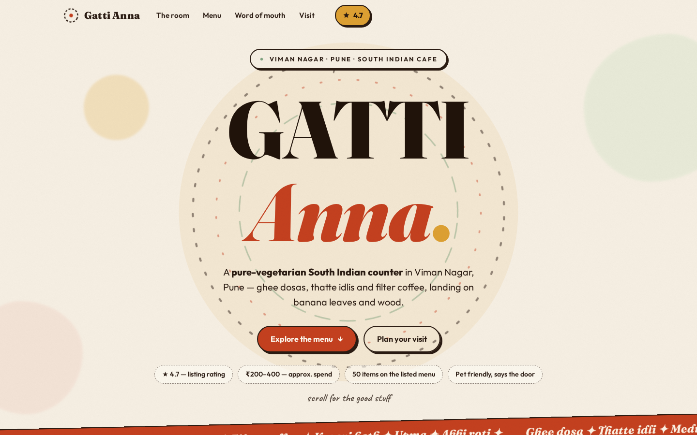
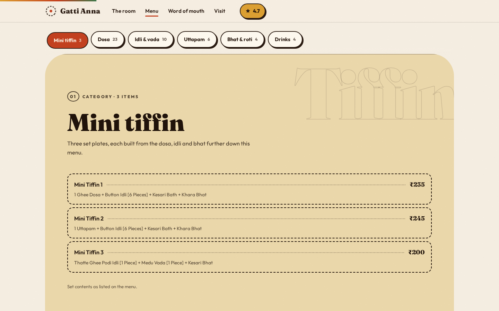

# Gatti Anna — cafe website

A scroll-led, art-directed single-page site for **Gatti Anna**, a pure-vegetarian
South Indian counter in **Viman Nagar, Pune**.

Open `index.html` (or serve the folder with any static server) — no build step,
no JavaScript libraries. One HTML file, one stylesheet, one script.

```bash
python3 -m http.server 8000
# → http://localhost:8000
```




## What's on the page

Six scroll sections: hero → the room → the menu board (six stacked colour
bands with a sticky category rail) → word of mouth → plan your visit → a night-time
closing. All motion is hand-rolled (one rAF ticker + IntersectionObservers) and is
fully disabled under `prefers-reduced-motion`.

## Fact provenance

Every fact on the page is traceable:

| Fact | Source |
| --- | --- |
| Name, Viman Nagar / Pune, **★ 4.7** rating, **₹200–400** spend | Supplied listing details (authoritative — aggregated figures that conflict are not used) |
| 50 menu items, prices, bestseller + Jain tags | Gatti Anna's public menu listing; disclosed on the page and shown "subject to change" |
| Diner quotes | Public Zomato listing, verbatim |
| "Pet friendly", "no outside food", wall/stair/poster texts, indoor + pavement tables | Directly visible in the supplied cafe photos |
| Opening hours, street address, phone, reservations, delivery | **Unconfirmed** — rendered on the page as visible "to be confirmed" placeholders, never guessed |

## Files

```
index.html    all markup + cafe facts
styles.css    full design system
script.js     scroll effects (progress, reveals, parallax, scroll-spy, count-up, dish preview)
images/       supplied cafe photography (the only imagery used)
```

Google Fonts (Fraunces, Outfit, Caveat) load via CDN with graceful local fallbacks;
everything else is self-contained.
